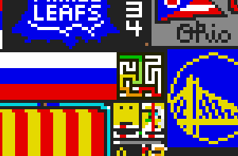

# Forked by Devedse

Let's add the following Maze to the /r/place board at position 215, 253:


Link to target:
[https://www.reddit.com/place?webview=true/#x=215&y=253](https://www.reddit.com/place?webview=true/#x=215&y=253)

Adding a maze to the board :), target:


The desired final result would be:


## Installation

You need to have [NodeJS installed](https://nodejs.org)

```
git clone https://github.com/zequez/reddit-place-bot
cd reddit-place-bot
npm install
```

## Configuration

Change `users.example.json` to `users.json` and add your username and password
of your account and all your throwaways.

## Target Drawing

If you run it as it is, is going to connect to the [placebot-argentina-target](https://github.com/Zequez/placebot-argentina-target) repository and try to draw
the `official_target.bmp`. If you don't want to do that you can open `config.js` and
set `autoupdateRemoteTarget: false`. This will make it use `target.bmp` instead. 

Every time it's time to place a pixel the bot will download the board
(and latest remote target) and find the first pixel that doesn't match
the target, and fill it with the correct color.

## About Colors

Since I honestly couldn't figure out how to make transparent BMP files I just
set it so that the color `#ff00ff` is considered transparent. Anything transparent
will be ignored.

You have to use the exact same colors as the board or the app is gonna throw
an error, it's not smart enough to guess the colors based on similarity.

## Usage

```
  npm run start
```

It'll keep keep drawing forever and if it can't draw anymore it's gonna
wait until something breaks and fix it.

## Testing

LOL

You can `npm run watch`, but that's about it.

## Similar Projects

Thanks to [trosh/rplace](https://github.com/trosh/rplace) to figure out how to actually read the bitmap from the server. I just ported that to Node.

## License

MIT
